# 🗂️ CATEGO

YouTube 구독 채널 폴더링 서비스<br/>

- 구독한 채널을 원하는 카테고리에 따라 폴더로 정리할 수 있습니다.
- https://catego.kro.kr

<br/>

## 1. 제작 기간 & 참여 인원

- 2024년 1월 16일 ~ 3월 23일
- 개인 프로젝트

<br/>

## 2. 사용 기술

- Java 17
- Spring Boot 3.2.1
- Gradle 8.5
- Spring Data JPA
- MySQL
- H2
- Spring Security
- OAuth2 Client
- Spring Web
- Spring Data Redis
- Thymeleaf
- YouTube Data API v3

</br>

## 3. ERD

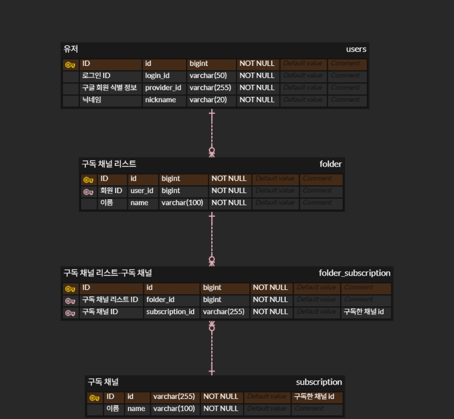

<br/>

## 4. 핵심 기능

### 4.1. 전체 흐름

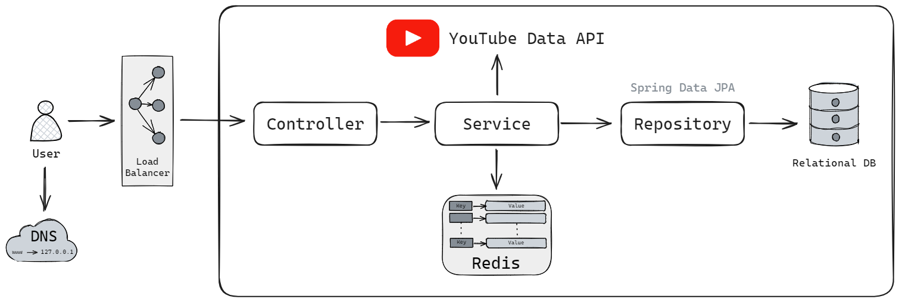

<br/>

### 4.2. 전체 기능

- 회원가입, 로그인/로그아웃
- 폴더 생성/수정/삭제/조회
- 사용자가 구독한 모든 유튜브 채널 조회
- 유튜브 채널 영상 조회
- 유튜브 영상 시청

<br/>

### 4.3. 핵심 기능

- 서비스의 핵심 기능은 폴더 관리(폴더 생성/수정/삭제/조회)입니다.

<details>
<summary><b>폴더 생성</b></summary>
<div markdown="1">

<br/>

**Controller**

- **AJAX를 이용한 비동기 통신 및 무한 스크롤**
  📌 [코드 확인](https://github.com/hbeeni/catego/blob/54022099c32a337e84d825a7df1dcfdb23a5424f/src/main/resources/templates/folder/create-folder-form.html#L43)
    - 폴더 생성 시 사용자가 구독한 유튜브 채널이 필요합니다.
    - 채널은 AJAX를 이용해 비동기 통신으로 가져옵니다.
    - 무한 스크롤을 구현합니다.

    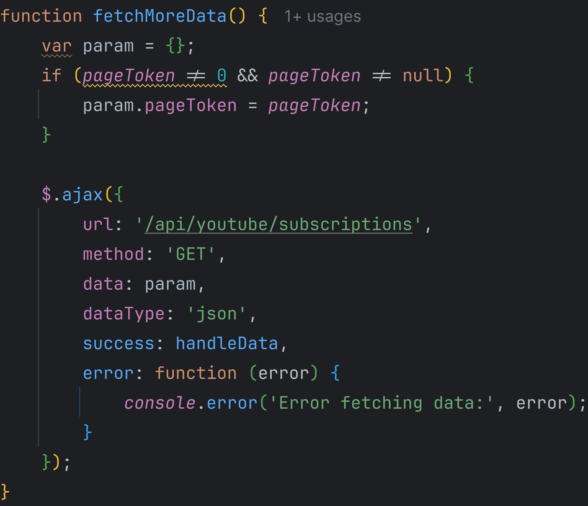

<br/>

- **YouTube Data API - 구독 채널 가져오기**
  📌 [코드 확인](https://github.com/hbeeni/catego/blob/54022099c32a337e84d825a7df1dcfdb23a5424f/src/main/java/com/been/catego/controller/api/YouTubeApiController.java#L25)
    - YouTube Data API를 호출해 사용자가 구독한 유튜브 채널을 가져옵니다.
    - 무한 스크롤을 구현했기 때문에 페이지 하단에 도달 시 `nextPageToken`을 호출해 다음 페이지를 가져옵니다.

    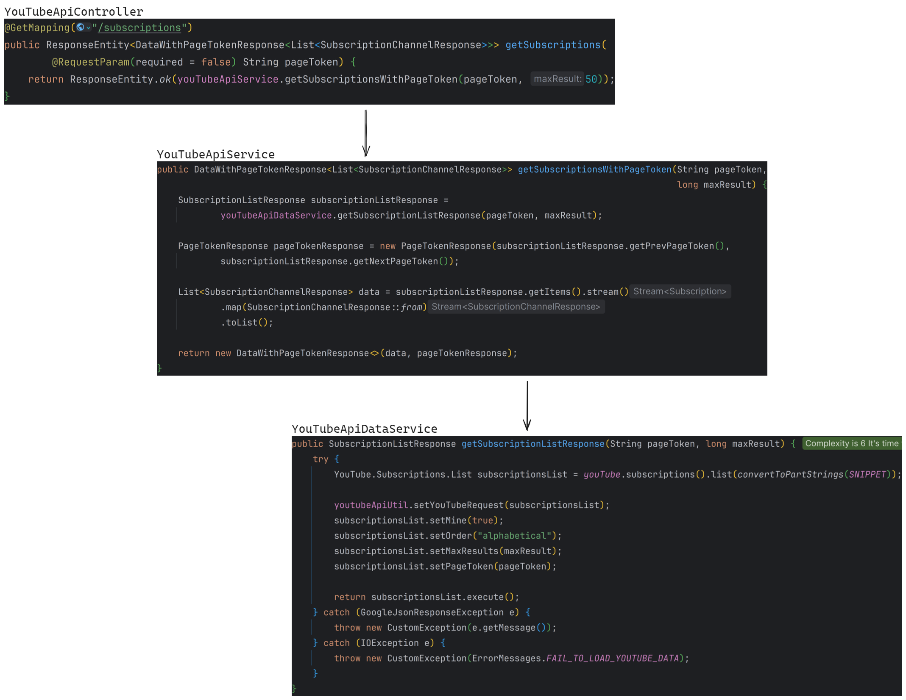

<br/>

- **요청 처리 및 채널 리스트 파싱**
  📌 [코드 확인](https://github.com/hbeeni/catego/blob/54022099c32a337e84d825a7df1dcfdb23a5424f/src/main/java/com/been/catego/controller/FolderController.java#L36)
    - 로그인한 사용자와 폴더 생성 정보를 요청으로 받습니다.
    - 선택한 채널은 `{채널_ID}|{채널_이름}` 형식으로 Controller에 전달됩니다.
    - `|`를 기준으로 분할해 `ChannelDto`를 생성합니다.
    - `Map<String, ChannelDto>` 형식으로 파싱해 Service에 전달합니다.

  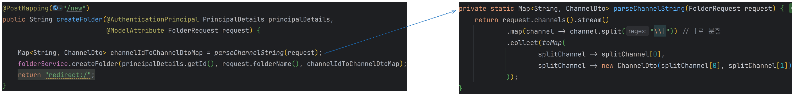

<br/>

**Service & Repository**

📌 [코드 확인](https://github.com/hbeeni/catego/blob/54022099c32a337e84d825a7df1dcfdb23a5424f/src/main/java/com/been/catego/service/FolderService.java#L111)

- **폴더 및 폴더 채널 저장**
    - DB에 저장되어 있지 않은 채널은 DB에 저장합니다.
    - 폴더 & 폴더 채널 엔티티를 생성한 후, 폴더 엔티티에 폴더 채널 엔티티를 set 합니다.
    - 폴더 엔티티를 저장합니다. 폴더 채널 엔티티는 `cascade` 옵션으로 인해 저장됩니다.

  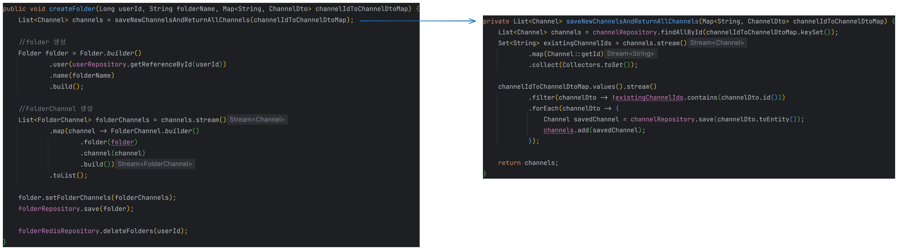

<br/>

- **Redis 폴더 정보 삭제**
    - Redis에 저장된 유저의 폴더 정보를 삭제합니다.
    - 폴더 정보는 조회 시 새롭게 저장합니다.

</div>
</details>

<details>
<summary><b>폴더 수정</b></summary>
<div markdown="1">

<details>
<summary><b>1. Form에 정보 전달</b></summary>
<div markdown="1">

<br/>

**Controller**

- **요청 처리**
  📌 [코드 확인](https://github.com/hbeeni/catego/blob/54022099c32a337e84d825a7df1dcfdb23a5424f/src/main/java/com/been/catego/controller/FolderController.java#L45)
    - 로그인한 유저, 수정하려는 폴더 ID를 요청으로 받습니다.
    - 반환하는 폴더 정보에는 폴더 ID, 폴더 이름, 폴더의 채널 갯수가 포함됩니다.

    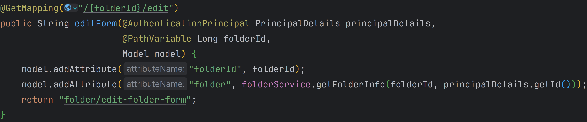

<br/>

**Service & Repository**

- **Form에 필요한 정보 가져오기**
  📌 [코드 확인](https://github.com/hbeeni/catego/blob/54022099c32a337e84d825a7df1dcfdb23a5424f/src/main/java/com/been/catego/service/FolderService.java#L78)
    - 사용자의 모든 폴더를 가져옵니다.
    - 응답 DTO로 변환해 반환합니다.

    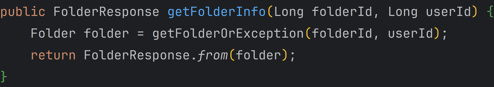

</div>
</details>

<details>
<summary><b>2. 구독 채널 가져오기</b></summary>
<div markdown="1">

<br/>

**Controller**

- **AJAX를 이용한 비동기 통신 및 무한 스크롤**
  📌 [코드 확인](https://github.com/hbeeni/catego/blob/54022099c32a337e84d825a7df1dcfdb23a5424f/src/main/resources/templates/folder/edit-folder-form.html#L44)
    - 폴더 수정 시 사용자가 구독한 유튜브 채널이 필요합니다.
    - 채널은 AJAX를 이용해 비동기 통신으로 가져옵니다.
    - 무한 스크롤을 구현합니다.
    - 폴더에 속한 채널은 `checked` 처리를 합니다.

    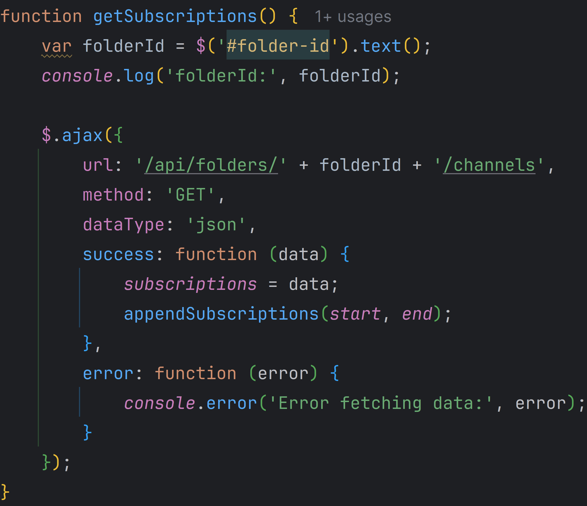

<br/>

- **요청 처리**
  📌 [코드 확인](https://github.com/hbeeni/catego/blob/54022099c32a337e84d825a7df1dcfdb23a5424f/src/main/java/com/been/catego/controller/api/FolderApiController.java#L24)
    - 로그인한 유저와 수정할 폴더 ID를 요청으로 받습니다.

  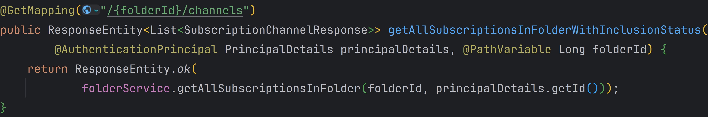

<br/>

**Service & Repository**

- **구독한 모든 유튜브 채널 가져오기**
  📌 [코드 확인](https://github.com/hbeeni/catego/blob/54022099c32a337e84d825a7df1dcfdb23a5424f/src/main/java/com/been/catego/service/FolderService.java#L87)
    - 폴더에 포함된 모든 채널을 가져옵니다.
    - YouTube API를 호출해 사용자가 구독한 유튜브 채널을 모두 가져와 응답 DTO로 변환합니다.
    - 그 중 폴더에 포함된 채널은 `includedInFolder=true`로 설정합니다.
    - 폴더에 속한 채널순 -> 채널 이름순으로 정렬하여 반환합니다.

    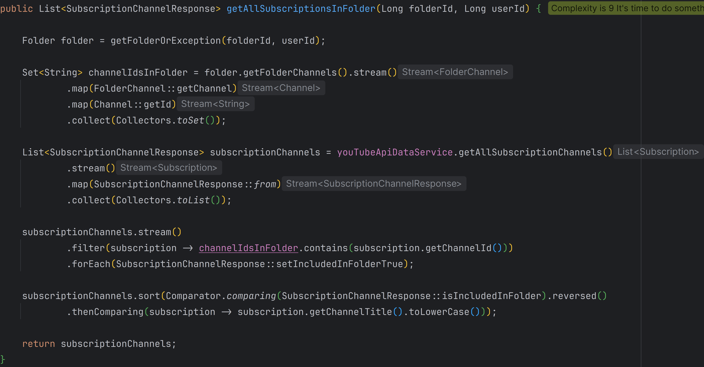

<br/>

- **YouTube Data API - 구독 채널 가져오기**
  📌 [코드 확인](https://github.com/hbeeni/catego/blob/54022099c32a337e84d825a7df1dcfdb23a5424f/src/main/java/com/been/catego/service/YouTubeApiDataService.java#L43)
    - YouTube Data API를 호출해 사용자가 구독한 유튜브 채널을 모두 가져옵니다.
    - 무한 스크롤로 구현했기 때문에 페이지 하단에 도달 시 `nextPageToken`을 호출해 다음 페이지를 가져옵니다.

    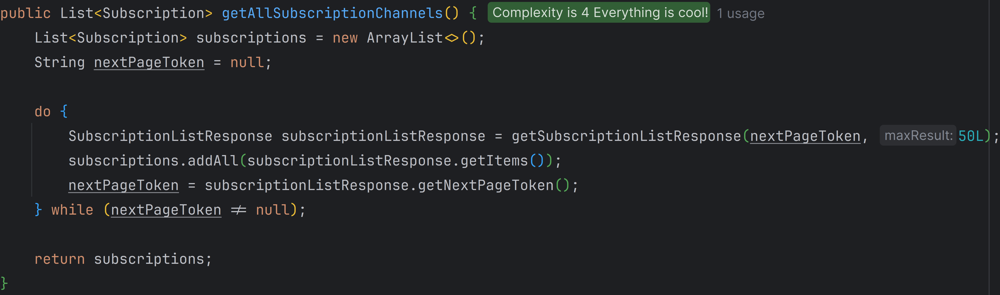

</div>
</details>

<details>
<summary><b>3. 폴더 수정하기</b></summary>
<div markdown="1">

<br/>

**Controller**

- **요청 처리 및 채널 리스트 파싱**
  📌 [코드 확인](https://github.com/hbeeni/catego/blob/54022099c32a337e84d825a7df1dcfdb23a5424f/src/main/java/com/been/catego/controller/FolderController.java#L54)
    - 로그인한 유저, 폴더 ID, 수정한 폴더 정보를 요청으로 받습니다.
    - 각 채널은 `{채널_ID}|{채널_이름}` 형식으로 Controller에 전달됩니다.
    - `|`를 기준으로 분할해 `ChannelDto`를 생성합니다.
    - `Map<String, ChannelDto>` 형식으로 파싱해 Service에 전달합니다.

    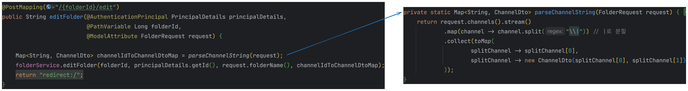

<br/>

**Service & Repository**

📌 [코드 확인](https://github.com/hbeeni/catego/blob/54022099c32a337e84d825a7df1dcfdb23a5424f/src/main/java/com/been/catego/service/FolderService.java#L134)

- **폴더 수정**
    - DB에 저장되어 있지 않은 채널은 DB에 저장합니다.
    - 사용자가 폴더 이름을 입력했다면 폴더 이름을 변경합니다.
    - 폴더에 새롭게 추가된 채널은 DB에 저장합니다.
    - 폴더에서 제외된 채널은 DB에서 삭제합니다.

    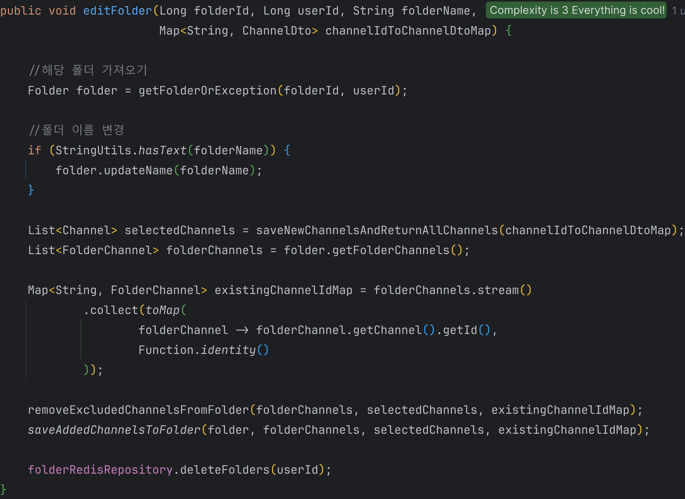

<br/>

- **Redis 폴더 정보 삭제**
    - Redis에 저장된 유저의 폴더 정보를 삭제합니다.
    - 폴더 정보는 조회 시 새롭게 저장합니다.

</div>
</details>

---

</div>
</details>

<details>
<summary><b>폴더 삭제</b></summary>
<div markdown="1">

<br/>

**Controller**

- **요청 처리**
  📌 [코드 확인](https://github.com/hbeeni/catego/blob/54022099c32a337e84d825a7df1dcfdb23a5424f/src/main/java/com/been/catego/controller/FolderController.java#L64)
    - 로그인한 유저, 폴더 ID를 요청으로 받습니다.

    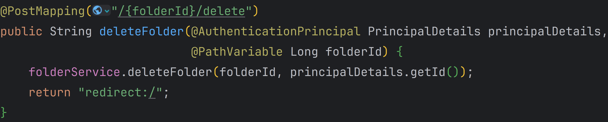

<br/>

**Service & Repository**

📌 [코드 확인](https://github.com/hbeeni/catego/blob/54022099c32a337e84d825a7df1dcfdb23a5424f/src/main/java/com/been/catego/service/FolderService.java#L194)

- **폴더 삭제**
    - 폴더 채널 엔티티를 batch delete 합니다.
    - 폴더 엔티티를 삭제합니다.

    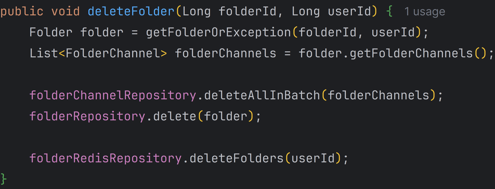

<br/>

- **Redis 폴더 정보 삭제**
    - Redis에 저장된 유저의 폴더 정보를 삭제합니다.
    - 폴더 정보는 조회 시 새롭게 저장합니다.

</div>
</details>

<details>
<summary><b>폴더 조회</b></summary>
<div markdown="1">

<br/>

**Interceptor**

- 폴더 정보는 사이드바에 표시됩니다.

  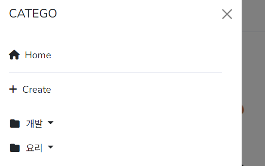

- 사이드바는 모든 페이지에 표시되기 때문에 폴더 정보 또한 모든 페이지에 가져와야 합니다.
- 따라서 `Interceptor`로 구현하였습니다.
  📌 [코드 확인](https://github.com/hbeeni/catego/blob/54022099c32a337e84d825a7df1dcfdb23a5424f/src/main/java/com/been/catego/interceptor/FolderListInterceptor.java#L16)
- 사용자의 모든 폴더 정보를 가져와 `ModelAndView`에 추가합니다.

  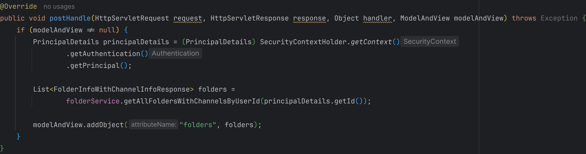

<br/>

**Service & Repository**

- **Redis에서 폴더 정보 가져오기**
  📌 [코드 확인](https://github.com/hbeeni/catego/blob/54022099c32a337e84d825a7df1dcfdb23a5424f/src/main/java/com/been/catego/repository/FolderRedisRepository.java#L40)
    - Redis에 폴더 정보가 저장되어 있으면 해당 정보를 반환합니다.
    - key는 `FOLDER:USER:{userId}` 입니다.
    - String으로 저장된 폴더 정보를 deserialize 하여 응답 DTO를 얻습니다.

  

<br/>

- **DB에서 폴더 정보 가져오기**
  📌 [코드 확인](https://github.com/hbeeni/catego/blob/54022099c32a337e84d825a7df1dcfdb23a5424f/src/main/java/com/been/catego/service/FolderService.java#L48)
    - Redis에 저장된 폴더 정보가 없으면 DB에서 폴더 정보를 가져옵니다.
    - 유저의 모든 폴더를 가져온 후, 해당 폴더의 채널도 모두 가져옵니다.
    - 폴더에 채널을 매핑해준 후, 응답 DTO로 변환합니다.

  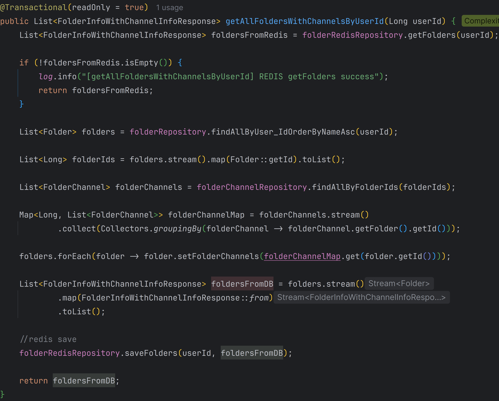

<br/>

- **Redis에 저장 후 반환**
  📌 [코드 확인](https://github.com/hbeeni/catego/blob/54022099c32a337e84d825a7df1dcfdb23a5424f/src/main/java/com/been/catego/repository/FolderRedisRepository.java#L26)
    - 폴더 정보를 String으로 serialize 해서 Redis에 저장합니다.
    - 폴더 정보를 반환합니다.

  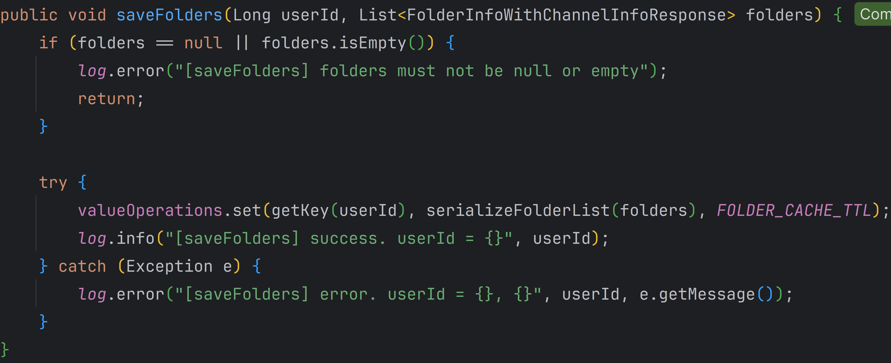

</div>
</details>

<br/>

## 5. 핵심 트러블 슈팅

### 5.1. 영속성 전이 옵션(`cascade`) 중 `REMOVE` 사용 시 엔티티가 하나씩 삭제되는 문제

- 폴더 엔티티 삭제 시 폴더 채널 엔티티도 같이 삭제하기 위해 `REMOVE` 옵션을 사용하였습니다.
- `REMOVE`를 사용하니까 엔티티가 IN 연산자로 한 번에 삭제되지 않고, 하나씩 삭제되는 문제가 발생하였습니다.

<details>
<summary><b>기존 코드</b></summary>
<div markdown="1">

```java
public class Folder {
    //...

    @OneToMany(mappedBy = "folder", cascade = {CascadeType.PERSIST, CascadeType.REMOVE})
    private List<FolderChannel> folderChannels = new ArrayList<>();
}
```

</div>
</details>

- 따라서 `REMOVE`는 사용하지 않고, batch delete를 사용해서 폴더 채널 엔티티를 먼저 삭제한 후, 폴더 엔티티를 삭제하였습니다.

<details>
<summary><b>개선된 코드</b></summary>
<div markdown="1">

```java
public class Folder {
    //...

    @OneToMany(mappedBy = "folder", cascade = CascadeType.PERSIST)
    private List<FolderChannel> folderChannels = new ArrayList<>();
}
```

```java
public class FolderService {
    //...

    public void deleteFolder(Long folderId, Long userId) {
        Folder folder = getFolderOrException(folderId, userId);
        List<FolderChannel> folderChannels = folder.getFolderChannels();

        folderChannelRepository.deleteAllInBatch(folderChannels); //폴더 채널 삭제
        folderRepository.delete(folder); //폴더 삭제

        folderRedisRepository.deleteFolders(userId);
    }
}
```

</div>
</details>

<br/>

### 5.2. 채널 저장 시 select 쿼리가 먼저 실행되는 문제

- 채널 엔티티는 자동 생성되는 칼럼이 아닌 직접 지정한 칼럼을 ID로 사용합니다.
- 이 경우 `save` 시 해당 엔티티가 DB에 존재하는 데이터인지 알아내기 위해 먼저 `select`가 실행되었습니다.

<br/>

- 따라서 `Persistable` 구현 + `@CreatedDate`로 새로운 데이터를 구분할 수 있게 하였습니다.
- 개선된 코드에서는 `select` 쿼리가 실행되지 않았습니다.

<details>
<summary><b>개선된 코드</b></summary>
<div markdown="1">

```java
public class Channel implements Persistable<String> {

    @Id
    private String id;

    @CreatedDate
    private LocalDateTime createdDate;

    //...

    @Override
    public String getId() {
        return id;
    }

    @Override
    public boolean isNew() {
        return createdDate == null;
    }
}
```

</div>
</details>

<br/>

### 5.3. YouTube Data API 할당량이 너무 빨리 줄어드는 문제

- YouTube Data API의 하루 할당량은 10,000번입니다.
- API를 별로 호출하지도 않았는데 할당량을 다 썼길래 찾아보니 `Search.List`의 cost가 무려 100이었습니다.
- 채널의 영상을 가져올 때 `Search.List`를 사용했기 때문에 할당량이 빠르게 줄어들었습니다.

<br/>

- 따라서 `Search.List` 대신 `PlaylistItems.List`를 사용하기로 하였습니다.
- `ChannelId`에서 첫 번째 인덱스를 'U'로 바꾼 후 재생목록을 조회하면 채널에 업로드 된 영상을 가져올 수 있습니다.
- 결과적으로 100 cost를 1 cost로 줄일 수 있었습니다.

<details>
<summary><b>개선된 코드</b></summary>
<div markdown="1">

```java
public PlaylistItemListResponse getVideosByChannelId(String channelId, long maxResult, String pageToken) {
    try {
        YouTube.PlaylistItems.List playlistItemsList = youTube.playlistItems().list(convertToPartStrings(SNIPPET));

        youtubeApiUtil.setYouTubeRequest(playlistItemsList);
        playlistItemsList.setPlaylistId(convertToUploadPlaylistId(channelId));
        playlistItemsList.setMaxResults(maxResult);
        playlistItemsList.setPageToken(pageToken);

        return playlistItemsList.execute();
    } catch (GoogleJsonResponseException e) {
        throw new CustomException(e.getMessage());
    } catch (IOException e) {
        throw new CustomException(ErrorMessages.FAIL_TO_LOAD_YOUTUBE_DATA);
    }
}
```

```java
/**
 * 채널 ID를 업로드된 동영상 재생목록 ID로 변환한다.
 */
public static String convertToUploadPlaylistId(String channelId) {
    char[] chars = channelId.toCharArray();
    chars[1] = 'U';
    return new String(chars);
}
```

</div>
</details>


</br>

## 6. 그 외 트러블 슈팅

<details>
<summary>구글 로그인 시 <code>DefaultOAuth2UserService</code>가 동작하지 않는 문제</summary>
<div markdown="1">

- 문제: 구글 로그인 시 `DefaultOAuth2UserService`가 실행되길 기대했는데 `OidcUserService`가 실행됨
- 헤결
    - OAuth2 scope엔 `email`, `profile`, `openid`가 있는데, scope를 따로 설정하지 않으면 모든 값이 넘어감
    - 이 때 `openid`가 넘어가면 `DefaultOAuth2UserService` 대신 `OidcUserService`가 실행됨
    - 따라서 scope를 `email`, `profile`로 설정

    ```yaml
    spring:
        security:
            oauth2:
                client:
                    registration:
                        google:
                            scope:
                                - email
                                - profile
    ```

</div>
</details>

<details>
<summary>구글 로그인 시 redirect_uri_mismatch 오류 발생 문제</summary>
<div markdown="1">

- Google Cloud로 배포 중, HTTPS 적용을 위해 로드 밸런서(Proxy server)를 사용 중임
- 이 때 웹 서버는 실제 클라이언트가 아닌 Proxy server가 접속한 것으로 인식해 https가 아닌 http로 리다이렉트해서 문제가 발생함
- 해결: `X-Forwarded-*` 헤더를 이용하여 최초 요청 정보(클라이언트 정보)를 담음

    ```yaml
    server:
    forward-headers-strategy: framework
    tomcat:
        remoteip:
        remote-ip-header: X-Forwarded-For
        protocol-header: X-Forwarded-Proto
        host-header: X-Forwarded-Host
        port-header: X-Forwarded-Port
    ```

</div>
</details>

<details>
<summary>로그아웃 시 <code>/login?logout</code>으로 리다이렉트되는 문제</summary>
<div markdown="1">

- 로그아웃 시 `/login?logout`으로 리다이렉트 됨
- 이 상태에서 다시 로그인을 하면 또 `/login?logout`으로 리다이렉트 되어 계속 로그아웃이 되는 문제가 발생함
- 해결: Security 설정에서 `logoutSuccessUrl`을 `/login`으로 설정

  ```java
  http.logout(logout -> logout.logoutSuccessUrl("/login"))
  ```

</div>
</details>

<details>
<summary><code>/</code> 접근 시에만 유저 닉네임, 프로필 사진이 표시되는 문제</summary>
<div markdown="1">

- 문제
    - 모든 페이지에서 `header`에 유저 정보가 표시되어야 하는데, `/` 접근 시에만 표시됨
    - 모든 접근에 정보를 넘겨줘야 하는데, `/` 접근 시에만 `model`에 정보를 넘겨서 그랬음
- 해결: 타임리프를 사용해서 `Authentication`에 접근함 -> `Controller`에서 정보를 넘겨주지 않아도 모든 페이지에서 유저 정보를 표시할 수 있었음

    ```html
    
    <div th:text="${#authentication.principal.nickname}">
    ```

</div>
</details>

<details>
<summary>폴더가 이름순으로 정렬되지 않는 문제</summary>
<div markdown="1">

- 문제: 폴더가 이름순으로 정렬되지 않고, 생성순으로 정렬됨
- 해결: 쿼리 메서드 네이밍에 `OrderBy`를 추가

    ```java
    List<Folder> findAllByUser_IdOrderByNameAsc(Long userId);
    ```

</div>
</details>

<details>
<summary>폴더 채널이 이름순으로 정렬되지 않는 문제</summary>
<div markdown="1">

- 문제: 사이드 바에 표시되는 폴더에서 채널이 이름순으로 정렬되지 않았음
- 해결: `order by`를 이용해 채널 이름순으로 정렬함

    ```java
    @Query("select fc from FolderChannel fc "
            + "join fetch fc.folder f "
            + "join fetch fc.channel c "
            + "where f.id in :folderIds "
            + "order by c.name")
    List<FolderChannel> findAllByFolderIdIn(@Param("folderIds") List<Long> folderIds);
    ```

</div>
</details>

<details>
<summary>HibernateException: A collection with cascade="all-delete-orphan" was no longer referenced by the owning entity</summary>
<div markdown="1">

- `orphanRemoval` 옵션으로 설정된 컬렉션이 비어 있지 않을 때 참조 인스턴스를 변경해서 오류가 발생함
- 폴더를 수정할 때 `setFolderChannels` 메서드를 사용해서 컬렉션 자체(`List<FolderChannel>`)를 변경했기 때문
- 해결: `orphanRemoval` 옵션 삭제

</div>
</details>

<details>
<summary>유튜브 동영상 댓글이 사용 중지 상태일 때 <code>null</code>로 표시되는 문제</summary>
<div markdown="1">

- 문제: 댓글이 사용 중지 상태면 YouTube API에서 `commentCount` 필드를 보내지 않기 때문에 `videoStatistics.getCommentCount()` 값이 `null`이 됨
- 해결
    - 동영상 응답 DTO에 `hasComments` 필드 추가
    - 프론트에서는 댓글이 있을 때만(`hasComments = true`) 댓글을 요청하도록 수정

    ```java
    private static boolean hasComments(VideoStatistics videoStatistics) {
        return videoStatistics.getCommentCount() != null && !videoStatistics.getCommentCount().equals(BigInteger.ZERO);
    }
    ```

    ```javascript
    document.addEventListener('DOMContentLoaded', function () {
        if ([[${videoPlayer.hasComments}]]) {
            fetchMoreData();
        } else {
            loading = true;
        }
    });
    ```

</div>
</details>

<details>
<summary>Google Cloud VM 인스턴스에 SCP 명령어로 파일 전송 시 SSH: Permission denied (publickey) 오류 발생 문제</summary>
<div markdown="1">

- 문제: public key와 매칭되는 private key를 찾을 수 없어서 오류가 발생
- 해결: 명령어 사용 시 private key 경로를 명시해줌

    ```
    scp -i /.ssh/gcp_catego_key catego-0.0.1-SNAPSHOT.jar {VM_인스턴스_IP}:/home/app
    ```

</div>
</details>
